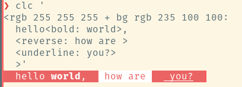
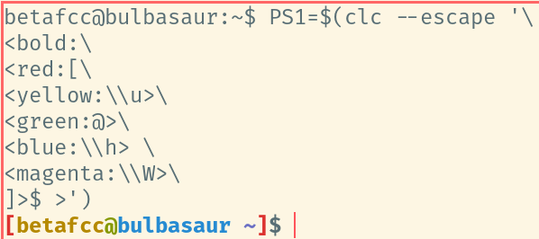

# clc
Tiny bash utility for  coloring terminal output and prompt


## Try it

```bash
bash <(curl -s https://raw.githubusercontent.com/betafcc/clc/master/clc) '<red:hello <reverse:world>'
```

## Install

```bash
curl -s https://raw.githubusercontent.com/betafcc/clc/master/clc | sudo tee /usr/local/bin/clc > /dev/null && sudo chmod +x /usr/local/bin/clc
```

Then use:

```bash
clc '<red:hello <reverse:world>'
```

## More



Use `-e|--espace` to escape invisible characters (needed for use in PS1):



Colors:
- black
- red
- green
- yellow
- blue
- magenta
- cyan
- white
- rgb <0-255> <0-255> <0-255>

For background instead of foreground, just prepend 'bg' to color

Attrs:
- normal
- bold
- underline
- reverse
- invisible
- blink

Combine more than one command with `+`, eg `<bold + blue + bg red: hi>`
